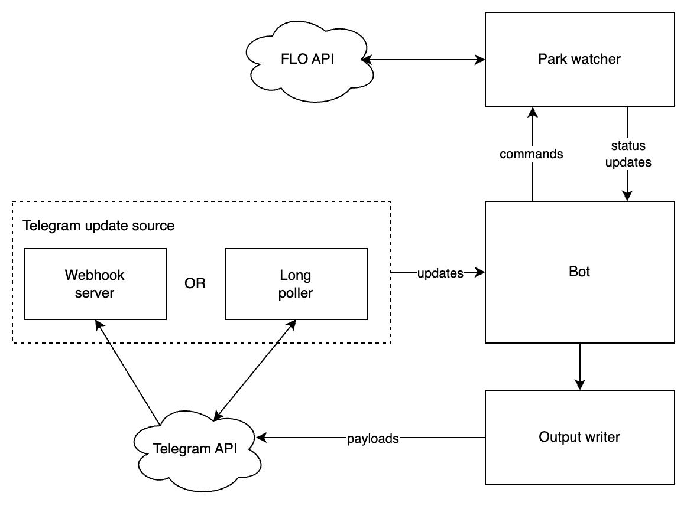

# Chargebot

This is a Telegram bot that can monitor your favourite EV charger stations and notify you of availability changes. 

## Demo

https://github.com/andreiko/chargebot/assets/340586/7ecc0220-d892-4b7e-bf9a-6e9962f7524f

## Architecture

Chargebot is an async program written in Rust using Tokio and around of the idea of message passing between 4 main components: 

